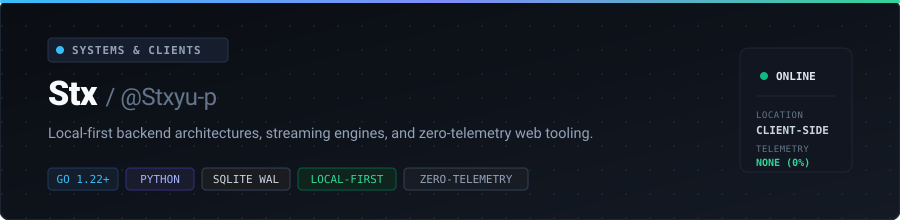

  

 

I build tools to solve friction I run into — mostly local-first, zero-telemetry, and minimal dependencies.

### 🛠️ Projects

| Project | What it does | Stack | Link |
| :--- | :--- | :--- | :--- |
| **🐾 NovelClaw** | Web novel reader with streaming AI translation | `Go` | [Repository ↗](https://github.com/Stxyu-p/NovelClaw) |
| **🧠 MemCore** | Governed local memory engine for autonomous agents | `Python` `SQLite` | [Repository ↗](https://github.com/Stxyu-p/memcore) |
| **⚡ Telefilter Desktop** | Telegram WebK media extractor & in-memory ZIP32 pack | `JavaScript` | [Greasy Fork ↗](https://greasyfork.org/scripts/596222-telefilter-desktop-edition-v5) |
| **⚡ IG MaxPland** | Instagram relationship scanner & stealth feed cleaner | `JavaScript` | [Greasy Fork ↗](https://greasyfork.org/scripts/595787-ig-maxpland) |
| **⚡ ThreadMax** | Threads bulk media downloader & floating PiP player | `JavaScript` | [Script ↗](https://raw.githubusercontent.com/Stxyu-p/threadmax/main/threadmax.user.js) |

---

  All data stays on device. No tracking, no external telemetry.

