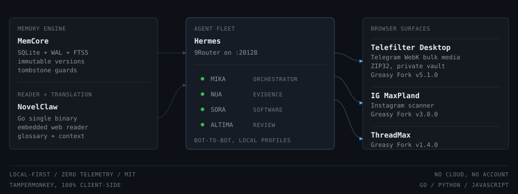

  <h1>⚙️ Stx</h1>
  
<strong>Engineering work by <a href="https://github.com/Stxyu-p">@Stxyu-p</a></strong>

  
Local-first systems, agent infrastructure, and browser tooling

  

    
    
    
    
    
    
  

---

## System Map

  

---

## Featured Projects

| Project | Domain | Architecture & Core Highlights | Distribution |
| :--- | :--- | :--- | :--- |
| **🧠 [MemCore](https://github.com/Stxyu-p/memcore)** | Multi-Agent Memory | Governed memory engine: SQLite + WAL + FTS5, immutable version history, tombstone guards, journal-first admission with semantic review. |  |
| **🐾 [NovelClaw](https://github.com/Stxyu-p/NovelClaw)** | Web Novels / AI Reader | Single-binary Go application, embedded zero-dependency web reader, 9Router/LLM translation pipeline, persistent glossary and context memory, SSE job streaming. |  |
| **⚡ [Telefilter Desktop](https://github.com/Stxyu-p/telefilter-desktop)** | Telegram WebK | Ultra-compact 34px inline toolbar, client-side ZIP32 multi-album packing, deep virtualized DOM harvester, privacy vault. |  |
| **⚡ [IG MaxPland](https://github.com/Stxyu-p/ig-maxpland)** | Instagram Web | Clean Architecture with 18 decoupled modules, stealth seen-telemetry interceptor across `fetch`, XHR and `sendBeacon`, zero-bounce clean feed, dormant radar with randomized jitter. |  |
| **⚡ [ThreadMax](https://github.com/Stxyu-p/threadmax)** | Threads Web | One-click carousel and bulk media extraction, in-memory ZIP32 compiler, video booster with PiP, tracking-sanitized links, thread unroller reader. |  |

---

## Install

| Project | Install |
| :--- | :--- |
| **Telefilter Desktop** | [Greasy Fork v5.1.0](https://greasyfork.org/scripts/596222-telefilter-desktop-edition-v5) |
| **IG MaxPland** | [Greasy Fork v3.0.0](https://greasyfork.org/scripts/595787-ig-maxpland) |
| **ThreadMax** | [Userscript RAW v1.4.0](https://raw.githubusercontent.com/Stxyu-p/threadmax/main/threadmax.user.js) |
| **MemCore** | Go 1.22+ / Python, MIT |
| **NovelClaw** | Go 1.22+, MIT |

---

## Engineering Principles

**Local-first and zero-telemetry.**
Data stays on the machine. No hidden network calls.

**Dependencies as a budget.**
Stdlib and native platform features before any third-party package.

**Governance over hope.**
Invariants enforced in code and schema, not conventions.

**Prove it by running it.**
Every claim backed by a test suite or a real execution log.

---

Curated showcase. Updated as projects ship.

